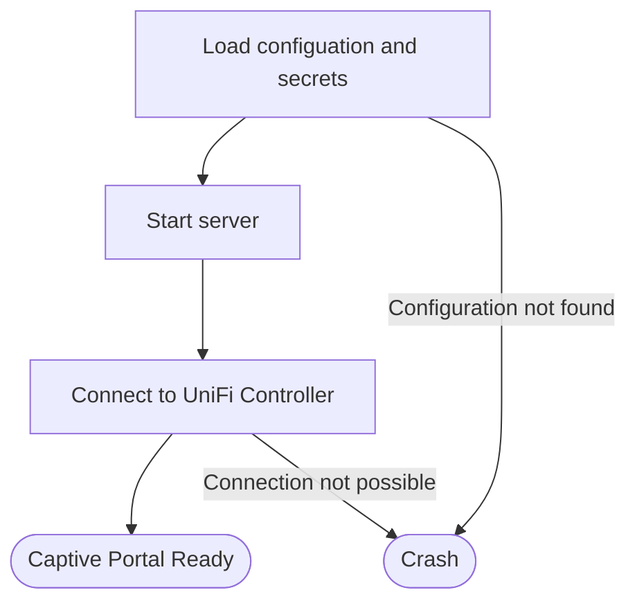
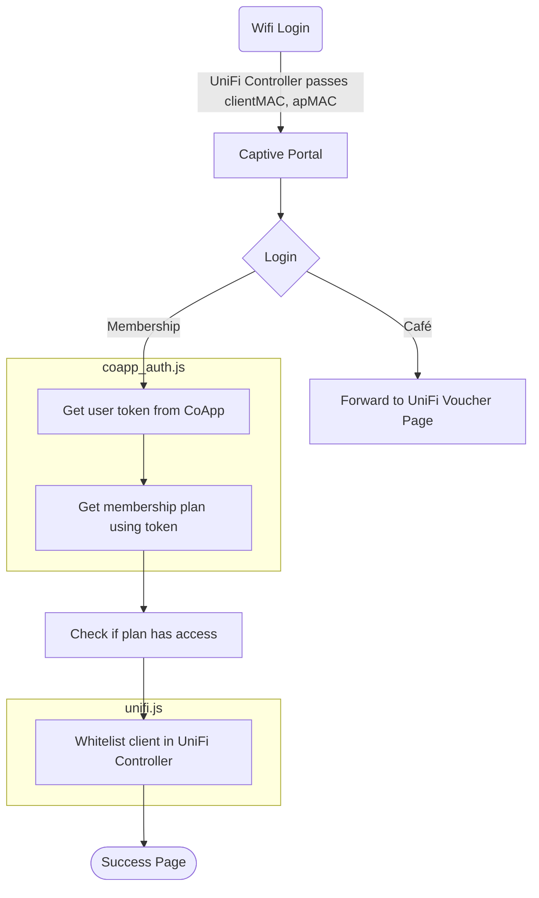

# Captifve
Captifve is a custom-built captive portal solution developed for [Hafven GmbH & Co KG](https://www.hafven.de). Users can access the wifi with their user account or vouchers from the café.

## Under the hood
### Technical Flow
1. When a user connects to the WiFi network, they are redirected to the captive portal
2. The user is presented with either a login form or a link to the UniFi Voucher Page
3. Upon submission, the app:
3.1 Authenticates with the CoApp API
3.2 Retrieves the user's membership plan
4. Checks if the plan is in the allowed list
4. If allowed, authorizes the user's device on the UniFi network
5. Redirects to a success page

### What file does what?
- `app.js`:The main file. All the logic bundling together the subprocesses is located in this file.
- `config.js`: Logging, Loading the `config.yaml` and `secrets.yaml`
- `coapp_auth.js`: Authentication with CoApp per Users
- `unifi.js`: Whitelisting client in UniFi Controller
- `config.yaml`: Configuration file (allowed membership plans, ports, etc.)
- `secrets.yaml`: Secrets file (passwords, etc.)

## Diagrams
### Server startup

### Login flowchart

